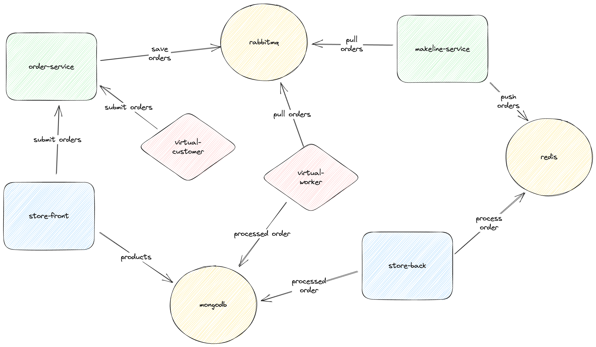

# AKS Store Demo

This sample demo app consists of a group of containerized microservices that can be easily deployed into an Azure Kubernetes Service (AKS) cluster. This is meant to show a realistic scenario using a polyglot architecture, event-driven design, and common open source back-end services (eg - MongoDB). 

> Note: This is not meant to be an example of perfect code to be used in production, but more about showing a realistic application running in AKS. 

To walk through a quick deployment of this application, see the [AKS Quickstart](https://learn.microsoft.com/azure/aks/learn/quick-kubernetes-deploy-cli).

To walk through a complete experience where this code is packaged into container images, uploaded to Azure Container Registry, and then run in and AKS cluster, see the [AKS Tutorials](https://learn.microsoft.com/en-us/azure/aks/tutorial-kubernetes-prepare-app).

## Architecture

The application has the following services: 

| Service | Description |
| --- | --- |
| `makeline-service` | This service handles processing orders from the queue and completing them (Golang) |
| `order-service` | This service is used for placing orders (Javascript) |
| `store-front` | Web app for customers to place and manage orders (Javascript) |
| `store-back` | Web app used by store employees to view orders in queue and manage products (Javascript) | 
| `virtual-customer` | Simulates order creation on a scheduled basis (Javascript) |
| `virtual-worker` | Simulates order completion on a scheduled basis (Javascript) |
| `ai-service` | Optional service for adding generative text and graphics creation |
| `mongodb` | MongoDB instance for persisted data |
| `rabbitmq` | RabbitMQ for an order queue |
| `redis` | Redis Cache |

Architecure Diagram:

## Testing and Getting Started

This [document](./docs/quickstart.md) has some intial commands to set this up in your own environment. Eventually these steps will be in the Azure docs in the links at the top. 

## Additional Resources

- AKS Documentation. https://learn.microsoft.com/en-us/azure/aks
- Kubernetes Learning Path. https://azure.microsoft.com/en-us/resources/kubernetes-learning-path 
